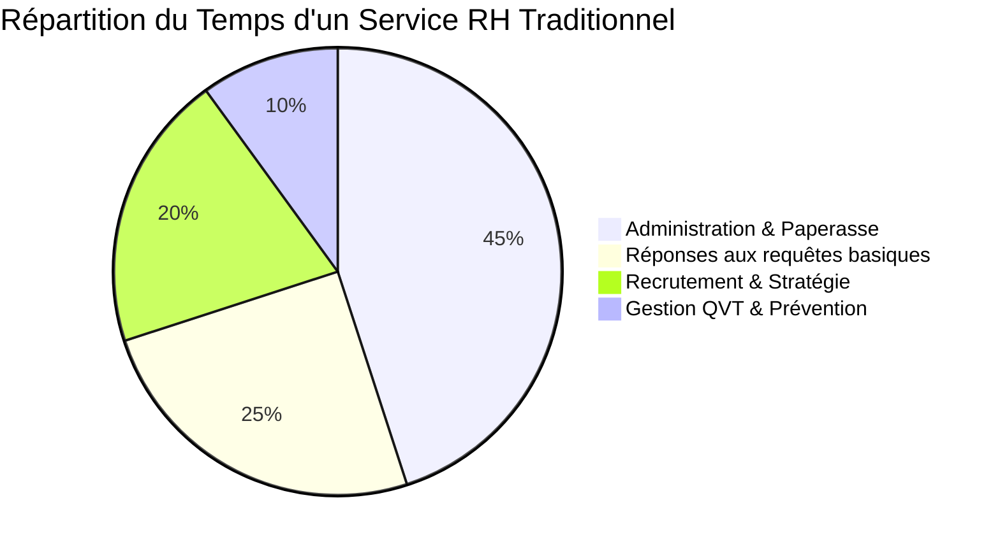
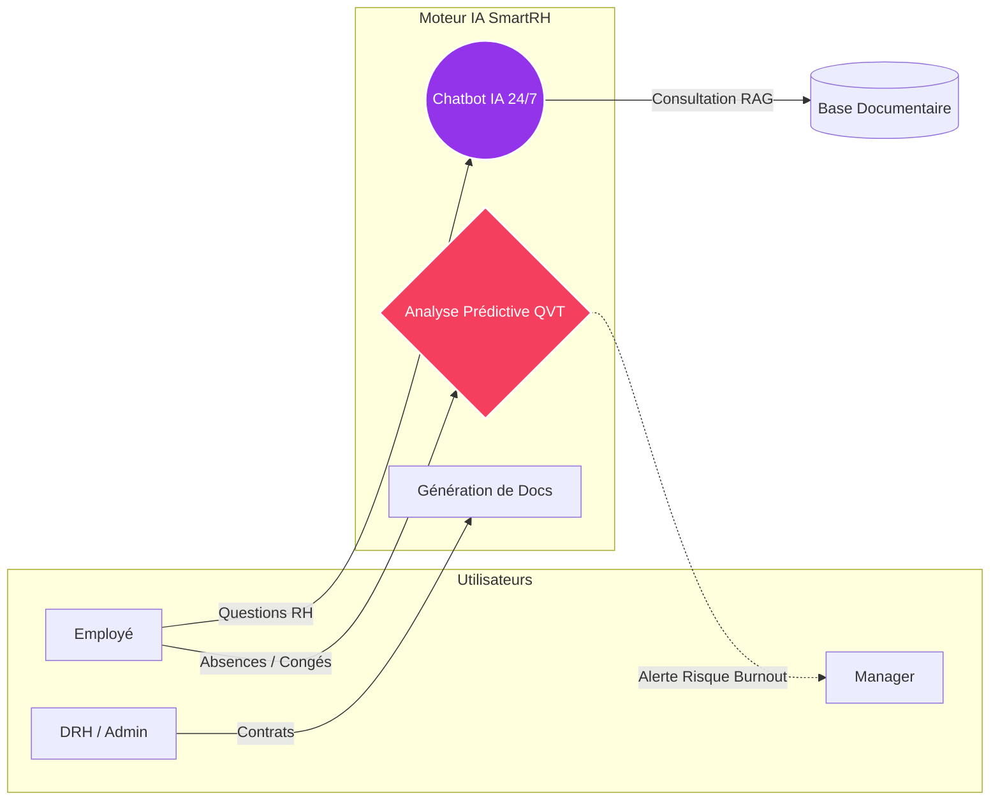
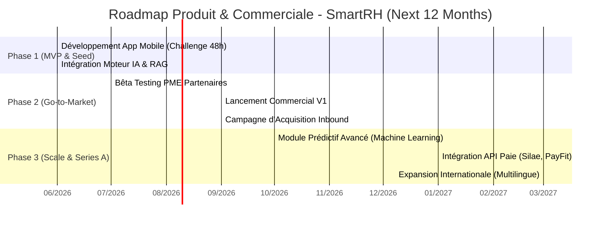
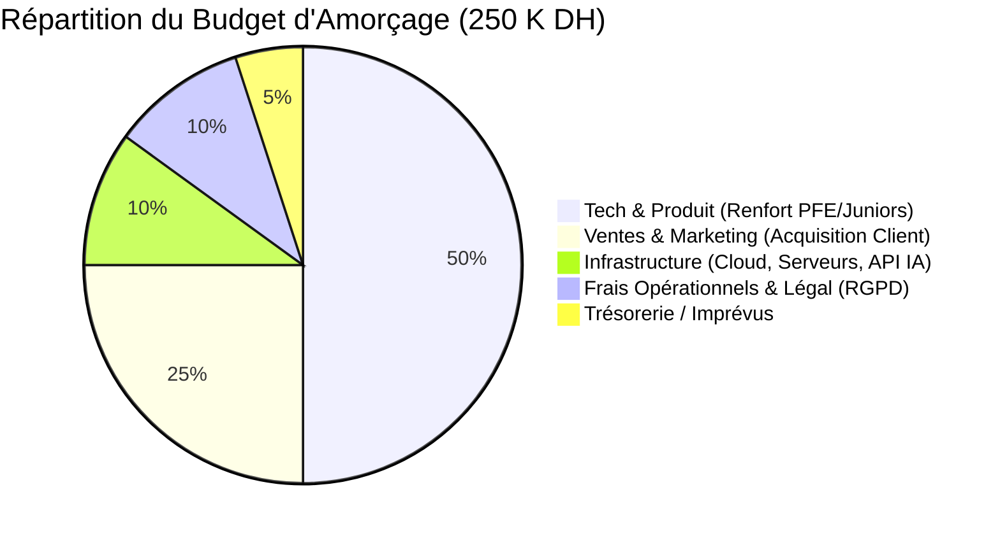

# 📊 Dossier Stratégique & Commercial : NexcoreRH (SmartRH)

## 1. Executive Summary (Résumé Exécutif)
**NexcoreRH (SmartRH)** est une plateforme RH "AI-First" conçue pour transformer radicalement l'expérience collaborateur et optimiser les coûts de gestion administrative. Développée dans le cadre d'un challenge d'innovation de 48h, notre solution démontre une vélocité d'exécution exceptionnelle. Nous répondons à un besoin critique des PME et ETI : **diviser par deux le temps consacré aux tâches administratives** pour réinvestir ce capital temps dans la stratégie et la qualité de vie au travail (QVT).

---

## 2. Le Problème : La Paralysie Administrative

Actuellement, les départements RH sont engorgés par des processus manuels et répétitifs, au détriment de l'accompagnement humain.

> [!WARNING]
> **Le Risque Caché :** La détection tardive du mal-être (burn-out) engendre un turnover coûteux. Un recrutement raté ou un départ imprévu coûte en moyenne entre 6 et 9 mois de salaire de l'employé à l'entreprise.

---

## 3. La Solution Technologique (Value Proposition)

NexcoreRH propose une application mobile et un portail web centralisés, propulsés par une Intelligence Artificielle Générative (RAG). 

### Fonctionnalités Clés :
1. **Assistant IA Conversationnel (RAG) :** Réponse instantanée aux questions (mutuelle, congés) en sourçant la base de connaissances interne.
2. **Génération Automatique :** Création instantanée de contrats et attestations de travail conformes.
3. **Analyse Prédictive (QVT) :** Algorithmes détectant les signaux faibles de surmenage via l'historique d'activité et d'absences, pour prévenir le burn-out *avant* qu'il n'arrive.

---

## 4. Analyse Concurrentielle (Focus Marché Marocain)

Dans notre modèle, nos véritables concurrents ne sont pas d'autres logiciels, mais les **agences de recrutement, d'intérim et les cabinets de conseil RH** massivement présents au Maroc. Les PME externalisent souvent par manque d'outils internes. Voici notre positionnement disruptif :

| Concurrent | Ce qu'ils proposent | Leurs faiblesses | L'Avantage SmartRH |
|:---|:---|:---|:---|
| **Tectra** *(Recrutement & Intérim)* | Sourcing de candidats et gestion externalisée de la paperasse. | Coûts exorbitants (commissions). Leur modèle profite du turn-over (plus les gens partent, plus ils gagnent). | **La Fidélisation :** Notre IA prévient le burn-out et les départs. Garder un talent coûte moins cher que de le remplacer via une agence. |
| **Diorh** *(Cabinet de Conseil RH)* | Missions d'audit du climat social et de conseil en organisation. | Audits très coûteux, réalisés à un instant "T", dont les recommandations finissent souvent dans un tiroir. | **L'Audit Continu :** Notre IA agit comme un consultant interne 24/7. Elle analyse le climat social en temps réel et alerte immédiatement. |
| **ReKrute** *(Plateforme de l'Emploi)* | Jobboard pour poster des offres et attirer des talents. | Focus exclusif sur l'avant-embauche. L'entreprise est livrée à elle-même pour gérer l'employé ensuite. | **La Gestion Post-Embauche :** Nous gérons le cycle de vie du talent (intégration, paperasse automatisée, bien-être) pour réduire le taux de démission. |

> [!TIP]
> **Le Positionnement "Océan Bleu" au Maroc :** Au lieu de payer des prestataires externes à prix d'or pour éteindre des incendies (remplacer un salarié qui démissionne, sous-traiter des contrats), SmartRH redonne le pouvoir aux PME marocaines en internalisant une **IA qui coûte le prix d'un logiciel, mais fait le travail d'un cabinet RH.**

---

## 5. Business Model & Scalabilité

Notre stratégie de revenus repose sur un modèle **SaaS (Software as a Service) B2B** très prédictible, avec une tarification par paliers (Tiered Pricing) par utilisateur et par mois (Per-Seat). 

### 5.1. Les Plans Tarifaires (Licences Récurrentes)

| Plan | Cible | Tarif | Fonctionnalités Incluses |
|:---|:---|:---|:---|
| **Gratuit** | Startups & TPE (Jusqu'à 20 collaborateurs) | **0 DH** / mois *(Sans engagement)* | Gestion des congés, Espace collaborateur, Gestion documentaire, Tableau de bord basique, Assistant IA (limité), Support standard. |
| **Premium** *(Recommandé)* | PME & Entreprises en croissance | **3 500 DH** / mois *(ou 35 000 DH / an)* | **Tout le Gratuit +** Assistant RH avancé, Workflows automatisés (On/Offboarding), Reporting avancé, Alertes intelligentes, Tableau de bord analytique. |
| **Enterprise**| Grands Groupes | À partir de **8 000 DH** / mois *(Sur mesure)* | **Tout le Premium +** IA prédictive du turnover, Détection du burnout, Analyse avancée, Connecteurs (Teams, Slack, PayFit), API dédiée. |

### 5.2. Revenus Additionnels (Up-sells)
- **Frais de Setup (1 000 € à 5 000 €) :** Pour l'ingestion de la base documentaire spécifique de l'entreprise (paramétrage de l'IA) et la formation initiale.
- **Connecteurs Premium :** +1€/user/mois pour la synchronisation automatique avec les logiciels de paie (Silae, PayFit).

### 5.3. KPI et Intérêt pour les investisseurs
- **Land and Expand :** Le MRR croît organiquement au fur et à mesure que les clients recrutent de nouveaux employés, sans effort commercial de notre part.
- **Stickiness (Rétention forte) :** Le taux de résiliation (Churn) dans le logiciel RH est historiquement l'un des plus faibles de l'industrie SaaS.

---

## 6. Marketing & Stratégie de Vente (Go-To-Market)

Comment allons-nous acquérir nos clients sur un marché concurrentiel, sans dépenser des millions en publicité classique ? 

1. **Les Partenariats Prescripteurs (Channel Sales) :** Notre levier principal. Nous allons proposer SmartRH aux **Cabinets d'Expertise Comptable** et aux **Consultants RH externes** en leur offrant 20% de commission d'apporteur d'affaires. Ils vendront la solution à leurs portefeuilles de clients PME à notre place.
2. **La Stratégie de l'Audit IA (Démonstration PoC) :** Pour convaincre les DRH récalcitrants, notre arme secrète est l'Audit Gratuit. Nous leur demandons 1 seul document PDF (ex: Règlement intérieur). Lors du rendez-vous, nous leur montrons en direct le Chatbot SmartRH répondant parfaitement aux questions sur *leur* document. L'effet "Wahou" signe la vente.
3. **Inbound & "ROI Calculator" :** Présence massive sur LinkedIn (où se trouvent les DRH) et un "Calculateur de Temps Perdu" sur notre site web (Lead Magnet) : le prospect rentre la taille de son équipe pour découvrir les économies d'heures et d'euros réalisables, en échange de son email.

> [!NOTE]
> **Le "Wedge" (L'Angle d'Attaque) :** Notre stratégie d'entrée chez un client n'est pas de dire *"Remplacez tout votre système RH"*. Nous disons : *"Gardez votre logiciel pour la paie, et utilisez SmartRH en complément pour automatiser vos attestations et prévenir le Burnout"*. Une fois l'outil adopté au quotidien, nous devenons indispensables.

---

## 7. Roadmap Stratégique et Déploiement

Nous avons structuré notre développement sur les 12 prochains mois pour passer du MVP actuel à un produit "Enterprise-Ready".

---

## 8. Le Besoin en Financement (The Ask)

Pour atteindre nos objectifs de la première année et acquérir nos premiers clients payants sans diluer excessivement le capital, nous levons un tour de "Pre-Seed" (Amorçage précoce).

> [!TIP]
> **Montant recherché : 250 000 DH**
> Cet investissement stratégique nous assurera un **runway (piste de trésorerie) de 12 à 18 mois**. L'équipe fondatrice ne se rémunérant pas la première année ("Sweat Equity"), 100% de ce budget sera injecté dans la croissance opérationnelle.

### Utilisation des Fonds (Use of Proceeds)

Nous avons opté pour une approche "Lean Startup" très saine financièrement :

1. **Pôle Tech & Produit (50% | 125 000 DH) :** Budget pour financer le recrutement de profils techniques à fort potentiel (ingénieurs juniors / stagiaires PFE) pour soutenir les fondateurs dans l'évolution de l'App Mobile et du modèle RAG.
2. **Ventes & Marketing (25% | 62 500 DH) :** Budget d'acquisition digital (Publicités LinkedIn) et logistique commerciale pour permettre aux fondateurs de démarcher directement les DRH.
3. **Infrastructure Cloud & IA (10% | 25 000 DH) :** Coûts d'hébergement sécurisé des bases de données et frais d'accès aux API de l'Intelligence Artificielle (modèles LLM).
4. **Légal, Sécurité & Conformité (10% | 25 000 DH) :** Frais de création, protection de la propriété intellectuelle, et audits de conformité (CNDP/RGPD pour les données RH).
5. **Trésorerie de Secours (5% | 12 500 DH)**

---

## 9. La Vision à 5 Ans & L'Équipe

Notre vision à long terme est ambitieuse : **Nous construisons le premier SIRH qui ne se contente pas de stocker les données de vos employés, mais qui les comprend et les protège.**

Dans 5 ans, SmartRH ne sera plus un simple outil de gestion, mais le **"Système Nerveux Central" (Super-App)** des PME européennes pour la gestion des talents :

1. **De l'Administration à la Stratégie :** L'automatisation quasi totale des requêtes administratives permettra aux départements RH de disparaître en tant que fonction "support" pour devenir une fonction purement stratégique (Coaching, Rétention, Culture).
2. **Du Réactif au Proactif :** Les logiciels classiques attendent qu'un employé pose sa démission. Notre IA prédictive aura analysé suffisamment de modèles pour identifier les risques d'attrition ou de burn-out *avant même* l'apparition des premiers symptômes.
3. **Le Compagnon IA Individuel :** Au-delà des RH, SmartRH deviendra un "coach IA de carrière" pour chaque employé, lui suggérant des formations personnalisées et l'aidant à piloter son évolution dans l'entreprise.

> [!IMPORTANT]
> **Pourquoi investir maintenant dans l'équipe SmartRH ?**
> En seulement 48 heures, notre équipe a architecturé, développé et déployé une plateforme multi-rôles extrêmement complexe réunissant : développement Mobile, Backend robuste, Bases de données relationnelles, intégration LLM, et Génération de PDF dynamiques.
>
> Nous avons prouvé notre capacité d'exécution hors du commun. Avec les bonnes ressources financières, SmartRH est prêt à s'imposer sur le marché.

---

## 10. Conclusion Générale

Pourquoi les PME marocaines n'ont-elles toujours pas passé le cap de la digitalisation RH totale ? Parce qu'on leur a toujours proposé des usines à gaz hors de prix.

Aujourd'hui, la donne a changé. Avec l'Intelligence Artificielle, nous avons l'opportunité unique de court-circuiter ces vieux systèmes. En 48 heures, notre équipe n'a pas juste codé une application : nous avons créé un "Océan Bleu". Une solution où l'employé utilise un outil aussi simple que WhatsApp, pendant que le dirigeant sécurise la santé de son entreprise et de ses talents.

Nous levons 250 000 euros pour capturer ce marché vierge avant que les acteurs historiques ne se réveillent. 

Investir dans SmartRH aujourd'hui, c'est investir dans l'équipe qui a eu l'agilité de créer ce produit en un week-end, et qui a maintenant l'ambition d'en faire le standard incontournable de toutes les PME marocaines demain. 

**Rejoignez-nous.**
